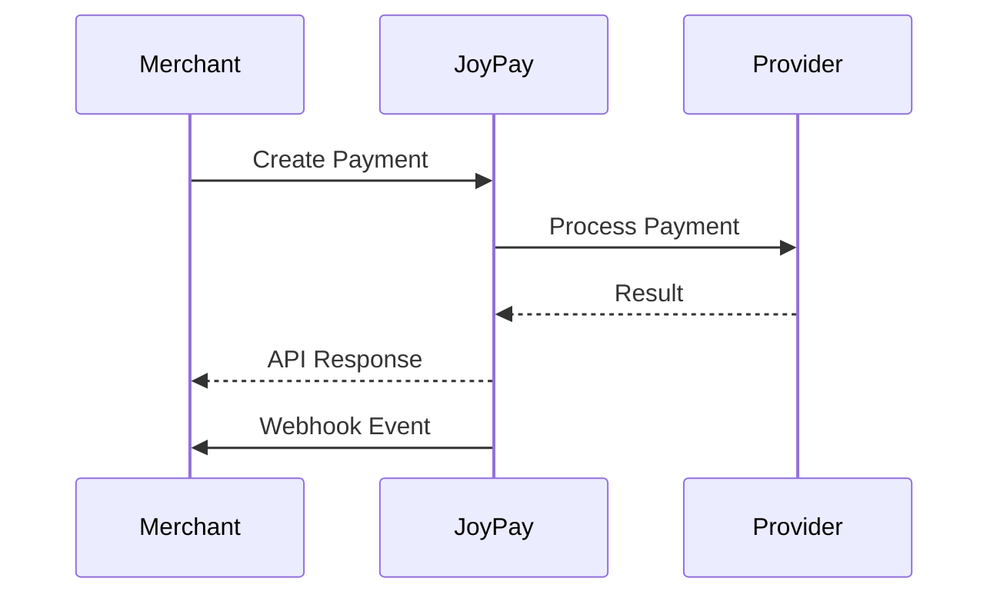

<div align="center">

# 💳 Joy Pay API Documentation

Modern payment infrastructure for merchants, platforms, and businesses.

Build secure payment experiences using HMAC authentication, webhook events, transaction tracking, and merchant management APIs.

---

### Quick Links

[Getting Started](#getting-started) •
[Authentication](#authentication) •
[Merchant](#merchant-apis) •
[Payments](#payment-apis) •
[Transactions](#transaction-apis) •
[Webhooks](#webhook-apis) •
[Error Codes](#error-codes)

</div>

---

## Base URLs

### Development

```http
http://localhost:3000/api/v1
```

---

## API Version

Current Version:

```text
v1
```

All endpoints are prefixed with:

```http
/api/v1
```

---

## Quick Start

Integrating Joy Pay requires only three steps:

1. Create Merchant Account
2. Generate HMAC Signature
3. Create Payment

---

## Authentication

Joy Pay uses two authentication mechanisms:

| Method | Usage |
|----------|----------|
| API Key + HMAC | Payment APIs |
| JWT Authentication | Merchant Dashboard APIs |

---

## API Key + HMAC Authentication

All payment endpoints require the following headers:

| Header | Required | Description |
|----------|----------|----------|
| x-api-key | Yes | Merchant API Key |
| x-timestamp | Yes | Current Unix Timestamp |
| x-signature | Yes | HMAC SHA256 Signature |

---

## Authentication Flow

```text
Request Body
      +
Current Timestamp
      │
      ▼

JSON.stringify(body) + timestamp
      │
      ▼

HMAC SHA256(secretKey)
      │
      ▼

Base64 Encode
      │
      ▼

x-signature
```

---

## Signature Generation (Node.js)

```javascript
const crypto = require("crypto");

const payload = {
  amount: 100,
  currency: "BDT",
  provider: "bkash"
};

const timestamp = Math.floor(Date.now() / 1000);

const signature = crypto
  .createHmac(
    "sha256",
    "sk_live_your_secret_key"
  )
  .update(
    JSON.stringify(payload) + timestamp
  )
  .digest("base64");

console.log(signature);
```

---

## Signature Generation (TypeScript)

```typescript
import crypto from "crypto";

function generateSignature(
  payload: object,
  timestamp: number,
  secretKey: string,
): string {
  return crypto
    .createHmac("sha256", secretKey)
    .update(
      JSON.stringify(payload) + timestamp
    )
    .digest("base64");
}
```

---

## Example Headers

```http
x-api-key: pk_live_xxxxxxxxx
x-timestamp: 1750855571
x-signature: 5WZK9c8nQW4B9...
```

---

## Example Payload

```typescript
const payload = JSON.stringify({ amount: 100, provider: 'bkash' });
const timestamp = Math.floor(Date.now() / 1000);
const signature = generateSignature(payload, timestamp, 'your-secret-key');
```

---

#### Signature Verification Flow

1. Merchant gets `apiKey` and `secretKey` from merchant creation response
2. For each API request, merchant generates:
   - `x-timestamp`: Current Unix timestamp (seconds)
   - `x-signature`: HMAC-SHA256 of `(JSON.stringify(body) + timestamp)` using `secretKey`
3. Server verifies the timestamp (within 5 minutes tolerance) and signature
4. If valid, the request is authenticated as that merchant

---

## Timestamp Validation

Joy Pay validates request timestamps to prevent replay attacks.

Rules:

- Maximum tolerance: 5 minutes
- Expired timestamps are rejected
- Future timestamps are rejected

Possible Error:

```json
{
  "statusCode": 401,
  "message": "Request timestamp expired or invalid"
}
```

---

## JWT Authentication

Used for dashboard endpoints.

Required Header:

```http
Authorization: Bearer <access_token>
```

---

#### Login

```bash
curl -X POST http://localhost:3000/api/v1/auth/login \
  -H "Content-Type: application/json" \
  -d '{
    "email": "contact@joypay.com",
    "secretKey": "sk_live_your_secret_key"
  }'
```

**Response:**
```json
{
  "status": 200,
  "success": true,
  "message": "Login successful",
  "data": {
    "accessToken": "eyJhbGciOiJIUzI1NiIs...",
    "merchantId": "uuid",
    "email": "contact@joypay.com",
    "name": "Tech Solutions Ltd"
  }
}
```

Save the `accessToken` and use it as `Bearer token` in the `Authorization` header for protected routes.

#### Get Profile

```bash
curl -X GET http://localhost:3000/api/v1/auth/profile \
  -H "Authorization: Bearer <accessToken>"
```

---

## Merchant APIs

### Create Merchant

Creates a new merchant account and returns API credentials.

```bash
curl -X POST http://localhost:3000/api/v1/merchant/create \
  -H "Content-Type: application/json" \
  -d '{
    "name": "Your Company Ltd",
    "email": "contact@yourcompany.com",
    "webhookUrl": "https://yourcompany.com/webhook"
  }'
```

**Response (201 Created):**
```json
{
  "id": "uuid",
  "name": "Your Company Ltd",
  "email": "contact@yourcompany.com",
  "apiKey": "pk_live_abc123...",
  "secretKey": "sk_live_xyz789...",
  "webhookUrl": "https://yourcompany.com/webhook",
  "isActive": true,
  "createdAt": "2024-01-01T00:00:00.000Z"
}
```

**After creating a merchant, save the API key and Secret key securely. They will not be shown again.**

### Get Merchant

```bash
curl -X GET http://localhost:3000/api/v1/merchant/{merchant_id}
```

**Response (200 OK):**
```json
{
  "id": "uuid",
  "name": "Your Company Ltd",
  "email": "contact@yourcompany.com",
  "apiKey": "pk_live_abc123...",
  "secretKey": "sk_live_xyz789...",
  "webhookUrl": "https://yourcompany.com/webhook",
  "isActive": true,
  "createdAt": "2024-01-01T00:00:00.000Z"
}
```

---

## Payment APIs

All payment endpoints require [API Key + HMAC authentication](#api-key--hmac-for-payment-apis).

### Create Payment

```bash
curl -X POST http://localhost:3000/api/v1/payments/create \
  -H "Content-Type: application/json" \
  -H "x-api-key: pk_live_your_api_key" \
  -H "x-timestamp: $(date +%s)" \
  -H "x-signature: generated_signature" \
  -d '{
    "amount": 100.50,
    "currency": "BDT",
    "provider": "bkash",
    "customerName": "John Doe",
    "customerEmail": "john@example.com",
    "description": "Order #12345"
  }'
```

**Response (201 Created):**
```json
{
  "sessionId": "uuid",
  "transactionId": "uuid",
  "redirectUrl": "http://localhost:3000/payments/uuid/result",
  "status": "success",
  "message": "Payment successful via bKash"
}
```

**Response (payment failed):**
```json
{
  "sessionId": "uuid",
  "transactionId": "uuid",
  "redirectUrl": "http://localhost:3000/payments/uuid/result",
  "status": "failed",
  "message": "Payment failed - insufficient balance"
}
```

### Get Payment Session

```bash
curl -X GET http://localhost:3000/api/v1/payments/{session_id} \
  -H "x-api-key: pk_live_your_api_key" \
  -H "x-timestamp: $(date +%s)" \
  -H "x-signature: generated_signature"
```

**Response (200 OK):**
```json
{
  "id": "uuid",
  "merchantId": "uuid",
  "amount": 100.50,
  "currency": "BDT",
  "status": "SUCCESS",
  "customerName": "John Doe",
  "customerEmail": "john@example.com",
  "description": "Order #12345",
  "createdAt": "2024-01-01T00:00:00.000Z",
  "transactions": [
    {
      "id": "uuid",
      "provider": "bkash",
      "status": "SUCCESS",
      "amount": 100.50
    }
  ]
}
```

### Cancel Payment

```bash
curl -X POST http://localhost:3000/api/v1/payments/{session_id}/cancel \
  -H "x-api-key: pk_live_your_api_key" \
  -H "x-timestamp: $(date +%s)" \
  -H "x-signature: generated_signature"
```

**Response (200 OK):**
```json
{
  "sessionId": "uuid",
  "status": "cancelled",
  "message": "Payment cancelled successfully"
}
```

---

## Transaction APIs

### Get Transaction by ID

```bash
curl -X GET http://localhost:3000/api/v1/transactions/{transaction_id} \
  -H "x-api-key: pk_live_your_api_key" \
  -H "x-timestamp: $(date +%s)" \
  -H "x-signature: generated_signature"
```

**Response (200 OK):**
```json
{
  "id": "uuid",
  "merchantId": "uuid",
  "sessionId": "uuid",
  "amount": 100.50,
  "status": "SUCCESS",
  "provider": "bkash",
  "providerTransactionId": "bKash_abc123...",
  "failureReason": null,
  "createdAt": "2024-01-01T00:00:00.000Z"
}
```

---

## Webhook APIs

### Webhook Test Endpoint

```bash
curl -X POST http://localhost:3000/api/v1/webhook/test \
  -H "Content-Type: application/json" \
  -d '{"event": "test.success", "data": {"test": true}}'
```

**Response:**
```json
{
  "received": true,
  "timestamp": "2024-01-01T00:00:00.000Z",
  "payload": {
    "event": "test.success",
    "data": { "test": true }
  }
}
```

---


## Payment Flow



---

## Supported Payment Providers

| Provider | Description |
|----------|----------|
| bkash | bKash Wallet |
| nagad | Nagad Wallet |
| card | Credit / Debit Card |

---

## Error Codes

| Code | Description |
|----------|----------|
| INVALID_API_KEY | Invalid API Key |
| INVALID_SIGNATURE | Invalid Signature |
| TIMESTAMP_EXPIRED | Timestamp Expired |
| MERCHANT_NOT_FOUND | Merchant Not Found |
| PAYMENT_NOT_FOUND | Payment Not Found |
| TRANSACTION_NOT_FOUND | Transaction Not Found |
| UNAUTHORIZED | Unauthorized Access |
| INTERNAL_SERVER_ERROR | Internal Server Error |

---


## Swagger Documentation

Interactive API documentation:

```text
http://localhost:3000/docs
```

---


## v1.0.0

- Merchant Management
- JWT Authentication
- HMAC Authentication
- Payment Processing
- Transaction Tracking
- Webhooks