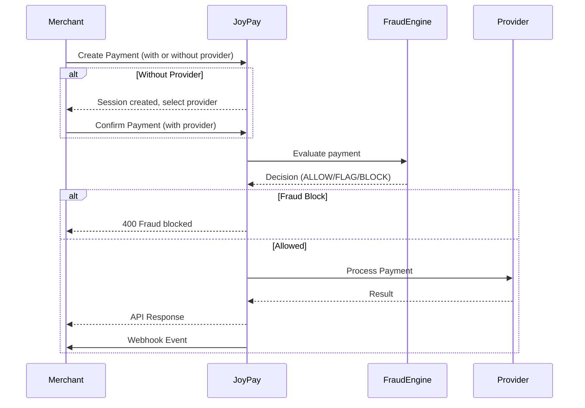

<div align="center">

# 💳 Joy Pay API Documentation

Modern payment infrastructure for merchants, platforms, and businesses.

Build secure payment experiences using HMAC authentication, webhook events, transaction tracking, fraud detection, and merchant management APIs.

---

### Quick Links

[Getting Started](#getting-started) •
[Authentication](#authentication) •
[Merchant](#merchant-apis) •
[Payments](#payment-apis) •
[Transactions](#transaction-apis) •
[Webhooks](#webhook-apis) •
[Fraud Detection](#fraud-detection-engine) •
[Provider Callbacks](#provider-callbacks) •
[Error Codes](#error-codes) •
[Environment Variables](#environment-variables)

</div>

---

## Base URLs

### Development

```http
http://localhost:3000/api/v1
```

---

## API Version

Current Version:

```text
v1
```

All endpoints are prefixed with:

```http
/api/v1
```

---

## Getting Started

Integrating Joy Pay requires only three steps:

1. Create Merchant Account
2. Generate HMAC Signature
3. Create Payment

---

## Authentication

Joy Pay uses two authentication mechanisms:

| Method | Usage |
|----------|----------|
| API Key + HMAC | Payment APIs, Transaction APIs |
| JWT Authentication | Merchant Dashboard APIs, Fraud Admin APIs |

---

## API Key + HMAC Authentication

All payment and transaction endpoints require the following headers:

| Header | Required | Description |
|----------|----------|----------|
| `x-api-key` | Yes | Merchant API Key |
| `x-timestamp` | Yes | Current Unix Timestamp (seconds) |
| `x-signature` | Yes | HMAC SHA256 Signature |

### Authentication Flow

```text
Request Body
      +
Current Timestamp
      │
      ▼

JSON.stringify(body) + timestamp
      │
      ▼

HMAC SHA256(secretKey)
      │
      ▼

Base64 Encode
      │
      ▼

x-signature
```

### Signature Generation (Node.js)

```javascript
const crypto = require("crypto");

const payload = {
  amount: 100,
  currency: "BDT",
  provider: "bkash"
};

const timestamp = Math.floor(Date.now() / 1000);

const signature = crypto
  .createHmac("sha256", "sk_live_your_secret_key")
  .update(JSON.stringify(payload) + timestamp)
  .digest("base64");
```

### Signature Generation (TypeScript)

```typescript
import crypto from "crypto";

function generateSignature(
  payload: object,
  timestamp: number,
  secretKey: string,
): string {
  return crypto
    .createHmac("sha256", secretKey)
    .update(JSON.stringify(payload) + timestamp)
    .digest("base64");
}
```

### Example Headers

```http
x-api-key: pk_live_xxxxxxxxx
x-timestamp: 1750855571
x-signature: 5WZK9c8nQW4B9...
```

### Signature Verification Flow

1. Merchant gets `apiKey` and `secretKey` from merchant creation response
2. For each API request, merchant generates:
   - `x-timestamp`: Current Unix timestamp (seconds)
   - `x-signature`: HMAC-SHA256 of `(JSON.stringify(body) + timestamp)` using `secretKey`
3. Server verifies the timestamp (within 5 minutes tolerance) and signature
4. If valid, the request is authenticated as that merchant

### Timestamp Validation

Joy Pay validates request timestamps to prevent replay attacks.

Rules:

- Maximum tolerance: 5 minutes
- Expired timestamps are rejected
- Future timestamps are rejected

Possible Error:

```json
{
  "statusCode": 401,
  "message": "Request timestamp expired or invalid"
}
```

---

## JWT Authentication

Used for dashboard and admin endpoints (auth profile, fraud rule management).

Required Header:

```http
Authorization: Bearer <access_token>
```

### Login

```bash
curl -X POST http://localhost:3000/api/v1/auth/login \
  -H "Content-Type: application/json" \
  -d '{
    "email": "contact@joypay.com",
    "secretKey": "sk_live_your_secret_key"
  }'
```

**Request Body:**

| Field | Type | Required | Description |
|-------|------|----------|-------------|
| `email` | string | Yes | Merchant email |
| `secretKey` | string | Yes | Merchant secret key |

**Response (200 OK):**
```json
{
  "status": 200,
  "success": true,
  "message": "Login successful",
  "data": {
    "accessToken": "eyJhbGciOiJIUzI1NiIs...",
    "merchantId": "uuid",
    "email": "contact@joypay.com",
    "name": "Tech Solutions Ltd"
  }
}
```

### Get Profile

```bash
curl -X GET http://localhost:3000/api/v1/auth/profile \
  -H "Authorization: Bearer <accessToken>"
```

**Response (200 OK):**
```json
{
  "status": 200,
  "success": true,
  "data": {
    "id": "uuid",
    "email": "contact@joypay.com",
    "name": "Tech Solutions Ltd"
  }
}
```

---

## Merchant APIs

### Create Merchant

Creates a new merchant account and returns API credentials.

```bash
curl -X POST http://localhost:3000/api/v1/merchant/create \
  -H "Content-Type: application/json" \
  -d '{
    "name": "Your Company Ltd",
    "email": "contact@yourcompany.com",
    "phone": "+8801712345678",
    "businessName": "Your Company Ltd",
    "businessType": "retail",
    "tradeLicense": "TL-123456",
    "businessRegNo": "BIN-1234567890",
    "tinNo": "TIN-123456",
    "businessAddress": "123 Gulshan Avenue, Dhaka",
    "businessWebsite": "https://yourcompany.com",
    "businessCategory": "ecommerce",
    "webhookUrl": "https://yourcompany.com/webhook"
  }'
```

**Request Body:**

| Field | Type | Required | Description |
|-------|------|----------|-------------|
| `name` | string | Yes | Contact person name |
| `email` | string | Yes | Merchant email (unique) |
| `phone` | string | Yes | Contact phone number |
| `businessName` | string | Yes | Business legal name |
| `businessType` | string | Yes | Type of business |
| `tradeLicense` | string | Yes | Trade license number |
| `businessRegNo` | string | No | Business registration number |
| `tinNo` | string | No | Tax identification number |
| `businessAddress` | string | Yes | Business physical address |
| `businessWebsite` | string (url) | No | Business website |
| `businessCategory` | string | Yes | Business category |
| `webhookUrl` | string (url) | No | Webhook notification URL |

**Response (201 Created):**
```json
{
  "id": "uuid",
  "name": "Your Company Ltd",
  "email": "contact@yourcompany.com",
  "apiKey": "pk_live_abc123...",
  "secretKey": "sk_live_xyz789...",
  "webhookUrl": "https://yourcompany.com/webhook",
  "isActive": true,
  "createdAt": "2024-01-01T00:00:00.000Z"
}
```

**After creating a merchant, save the API key and Secret key securely. They will not be shown again.**

### Get Merchant

```bash
curl -X GET http://localhost:3000/api/v1/merchant/{merchant_id}
```

**Response (200 OK):**
```json
{
  "id": "uuid",
  "name": "Your Company Ltd",
  "email": "contact@yourcompany.com",
  "apiKey": "pk_live_abc123...",
  "secretKey": "sk_live_xyz789...",
  "webhookUrl": "https://yourcompany.com/webhook",
  "isActive": true,
  "createdAt": "2024-01-01T00:00:00.000Z"
}
```

---

## Payment APIs

All payment endpoints require [API Key + HMAC authentication](#api-key--hmac-authentication).

### Create Payment

Creates a new payment session. Can be called with or without a provider.

#### Without provider (initiate session first)

```bash
curl -X POST http://localhost:3000/api/v1/payments/create \
  -H "Content-Type: application/json" \
  -H "x-api-key: pk_live_your_api_key" \
  -H "x-timestamp: $(date +%s)" \
  -H "x-signature: generated_signature" \
  -d '{
    "amount": 100.50,
    "currency": "BDT",
    "customerName": "John Doe",
    "customerEmail": "john@example.com",
    "description": "Order #12345"
  }'
```

**Response (201 Created) — without provider:**
```json
{
  "sessionId": "uuid",
  "status": "initiated",
  "message": "Payment session created. Select a payment method to continue.",
  "availableProviders": ["bkash", "nagad"]
}
```

#### With provider (direct payment)

```bash
curl -X POST http://localhost:3000/api/v1/payments/create \
  -H "Content-Type: application/json" \
  -H "x-api-key: pk_live_your_api_key" \
  -H "x-timestamp: $(date +%s)" \
  -H "x-signature: generated_signature" \
  -d '{
    "amount": 100.50,
    "currency": "BDT",
    "provider": "bkash",
    "customerName": "John Doe",
    "customerEmail": "john@example.com",
    "description": "Order #12345"
  }'
```

**Request Body:**

| Field | Type | Required | Description |
|-------|------|----------|-------------|
| `amount` | number | Yes | Payment amount |
| `currency` | string | No | Currency code (default: `BDT`) |
| `provider` | string | No | Provider: `bkash`, `nagad`, `mock_bkash`, `mock_nagad`, `mock_card` |
| `customerName` | string | No | Customer name |
| `customerEmail` | string | No | Customer email |
| `description` | string | No | Payment description |

**Response (201 Created) — with provider (success):**
```json
{
  "sessionId": "uuid",
  "transactionId": "uuid",
  "redirectUrl": "https://...",
  "status": "success",
  "message": "Payment successful via bKash",
  "fraudScore": 0,
  "fraudDecision": "ALLOW"
}
```

**Response (201 Created) — with provider (failed):**
```json
{
  "sessionId": "uuid",
  "transactionId": "uuid",
  "redirectUrl": null,
  "status": "failed",
  "message": "Payment failed - insufficient balance",
  "fraudScore": 0,
  "fraudDecision": "ALLOW"
}
```

### Confirm Payment

Confirms a previously initiated payment session with a selected provider.

```bash
curl -X POST http://localhost:3000/api/v1/payments/{session_id}/confirm \
  -H "Content-Type: application/json" \
  -H "x-api-key: pk_live_your_api_key" \
  -H "x-timestamp: $(date +%s)" \
  -H "x-signature: generated_signature" \
  -d '{
    "provider": "bkash",
    "cardDetails": {
      "cardNumber": "4111111111111111",
      "cardholderName": "John Doe",
      "expiry": "12/28",
      "cvv": "123"
    },
    "ip": "192.168.1.1",
    "userAgent": "Mozilla/5.0..."
  }'
```

**Request Body:**

| Field | Type | Required | Description |
|-------|------|----------|-------------|
| `provider` | string | Yes | Provider: `bkash` or `nagad` |
| `cardDetails` | object | No | Card details (for card payments) |
| `cardDetails.cardNumber` | string | No | Card number |
| `cardDetails.cardholderName` | string | No | Cardholder name |
| `cardDetails.expiry` | string | No | Expiry date (MM/YY) |
| `cardDetails.cvv` | string | No | CVV code |
| `ip` | string | No | Customer IP address |
| `userAgent` | string | No | Customer user agent |

**Response (200 OK) — redirect required:**
```json
{
  "sessionId": "uuid",
  "transactionId": "uuid",
  "redirectUrl": "https://provider.checkout.url/...",
  "status": "pending",
  "message": "Redirecting to bKash for payment",
  "fraudScore": 0,
  "fraudDecision": "ALLOW"
}
```

**Response (200 OK) — direct result:**
```json
{
  "sessionId": "uuid",
  "transactionId": "uuid",
  "status": "success",
  "message": "Payment successful via bKash",
  "fraudScore": 0,
  "fraudDecision": "ALLOW"
}
```

### Get Payment Session

```bash
curl -X GET http://localhost:3000/api/v1/payments/{session_id} \
  -H "x-api-key: pk_live_your_api_key" \
  -H "x-timestamp: $(date +%s)" \
  -H "x-signature: generated_signature"
```

**Response (200 OK):**
```json
{
  "id": "uuid",
  "merchantId": "uuid",
  "amount": 100.50,
  "currency": "BDT",
  "status": "SUCCESS",
  "customerName": "John Doe",
  "customerEmail": "john@example.com",
  "description": "Order #12345",
  "createdAt": "2024-01-01T00:00:00.000Z",
  "transactions": [
    {
      "id": "uuid",
      "provider": "bkash",
      "status": "SUCCESS",
      "amount": 100.50,
      "fraudCheck": { ... }
    }
  ]
}
```

**Possible statuses:** `INITIATED`, `PENDING`, `SUCCESS`, `FAILED`, `CANCELLED`

### Cancel Payment

```bash
curl -X POST http://localhost:3000/api/v1/payments/{session_id}/cancel \
  -H "x-api-key: pk_live_your_api_key" \
  -H "x-timestamp: $(date +%s)" \
  -H "x-signature: generated_signature"
```

**Response (200 OK):**
```json
{
  "sessionId": "uuid",
  "status": "cancelled",
  "message": "Payment cancelled successfully"
}
```

### Get Available Providers

```bash
curl -X GET http://localhost:3000/api/v1/payments/providers \
  -H "x-api-key: pk_live_your_api_key" \
  -H "x-timestamp: $(date +%s)" \
  -H "x-signature: generated_signature"
```

**Response (200 OK):**
```json
{
  "mfs": ["bkash", "nagad"]
}
```

---

## Transaction APIs

All transaction endpoints require [API Key + HMAC authentication](#api-key--hmac-authentication).

### Get Transaction by ID

```bash
curl -X GET http://localhost:3000/api/v1/transactions/{transaction_id} \
  -H "x-api-key: pk_live_your_api_key" \
  -H "x-timestamp: $(date +%s)" \
  -H "x-signature: generated_signature"
```

**Response (200 OK):**
```json
{
  "id": "uuid",
  "merchantId": "uuid",
  "sessionId": "uuid",
  "amount": 100.50,
  "status": "SUCCESS",
  "provider": "bkash",
  "providerTransactionId": "bKash_abc123...",
  "failureReason": null,
  "createdAt": "2024-01-01T00:00:00.000Z"
}
```

**Possible statuses:** `INITIATED`, `PENDING`, `SUCCESS`, `FAILED`, `CANCELLED`

---

## Webhook APIs

### Test Webhook

```bash
curl -X POST http://localhost:3000/api/v1/webhook/test \
  -H "Content-Type: application/json" \
  -d '{"event": "test.success", "data": {"test": true}}'
```

**Response (200 OK):**
```json
{
  "received": true,
  "timestamp": "2024-01-01T00:00:00.000Z",
  "payload": {
    "event": "test.success",
    "data": { "test": true }
  }
}
```

### Webhook Events

Joy Pay sends webhook events to the merchant's configured `webhookUrl` when payment status changes. Events are signed with HMAC-SHA256 using the merchant's `secretKey`.

**Headers:**

| Header | Description |
|--------|-------------|
| `X-Timestamp` | Unix timestamp of the event |
| `X-Signature` | HMAC-SHA256 of `(payload + timestamp)` |
| `X-Event-Type` | Event type identifier |

**Events:**

| Event | Description |
|-------|-------------|
| `payment.success` | Payment completed successfully |
| `payment.failed` | Payment failed |
| `payment.cancelled` | Payment was cancelled |

#### payment.success

```json
{
  "event": "payment.success",
  "transactionId": "uuid",
  "amount": 100,
  "provider": "bkash",
  "providerTransactionId": "bKash_ref_123",
  "timestamp": "2026-01-01T00:00:00.000Z"
}
```

#### payment.failed

```json
{
  "event": "payment.failed",
  "transactionId": "uuid",
  "amount": 100,
  "provider": "bkash",
  "failureReason": "Insufficient balance",
  "timestamp": "2026-01-01T00:00:00.000Z"
}
```

#### payment.cancelled

```json
{
  "event": "payment.cancelled",
  "sessionId": "uuid",
  "timestamp": "2026-01-01T00:00:00.000Z"
}
```

---

## Provider Callbacks

These endpoints are called by external payment providers (bKash, Nagad) to notify Joy Pay of payment results. Not intended for merchant use.

### bKash Callback

```http
POST /api/v1/provider/bkash/callback
```

Redirects to:
- `/payment/success?ref={paymentID}` on success
- `/payment/cancelled` on cancel
- `/payment/failed` on failure

### Nagad Callback

```http
POST /api/v1/provider/nagad/callback
```

Redirects to:
- `/payment/success?ref={payment_ref_id}` on success
- `/payment/failed` on failure

---

## Fraud Detection Engine

Joy Pay includes a configurable fraud detection engine that evaluates payments in real time.

### Fraud Admin APIs

All fraud admin endpoints require [JWT authentication](#jwt-authentication).

#### List Fraud Rules

```bash
curl -X GET http://localhost:3000/api/v1/merchant/{merchantId}/fraud-rules \
  -H "Authorization: Bearer <accessToken>"
```

#### Create Fraud Rule

```bash
curl -X POST http://localhost:3000/api/v1/merchant/{merchantId}/fraud-rules \
  -H "Content-Type: application/json" \
  -H "Authorization: Bearer <accessToken>" \
  -d '{
    "ruleType": "AMOUNT_THRESHOLD",
    "config": {
      "maxAmount": 50000,
      "threshold": 80
    },
    "action": "BLOCK",
    "priority": 1
  }'
```

**Request Body:**

| Field | Type | Required | Description |
|-------|------|----------|-------------|
| `ruleType` | string | Yes | Rule type (see below) |
| `config` | object | Yes | Rule-specific configuration |
| `action` | string | Yes | `ALLOW`, `FLAG`, or `BLOCK` |
| `priority` | number | No | Execution priority (lower = higher) |

#### Update Fraud Rule

```bash
curl -X PUT http://localhost:3000/api/v1/merchant/{merchantId}/fraud-rules/{ruleId} \
  -H "Content-Type: application/json" \
  -H "Authorization: Bearer <accessToken>" \
  -d '{
    "enabled": false,
    "config": { "maxAmount": 100000 },
    "action": "FLAG",
    "priority": 2
  }'
```

#### Delete Fraud Rule

```bash
curl -X DELETE http://localhost:3000/api/v1/merchant/{merchantId}/fraud-rules/{ruleId} \
  -H "Authorization: Bearer <accessToken>"
```

#### Get Fraud Check Result

```bash
curl -X GET http://localhost:3000/api/v1/merchant/{merchantId}/fraud-rules/check/{transactionId} \
  -H "Authorization: Bearer <accessToken>"
```

### Available Rule Types

| Rule Type | Description | Config Parameters |
|-----------|-------------|-------------------|
| `AMOUNT_THRESHOLD` | Blocks payments above a max amount | `maxAmount` (number), `threshold` (number, % of max) |
| `VELOCITY` | Flags rapid successive payments | `maxAttempts` (number), `timeWindowMin` (number) |
| `BIN_BLOCK` | Blocks specific card BINs | `blockedBins` (string[]) |
| `IP_COUNTRY_MISMATCH` | Flags card country vs IP mismatches | `allowedCountries` (string[], country codes) |
| `TIME_RESTRICTION` | Blocks payments during restricted hours/days | `blockedHours` (number[]), `blockedDays` (number[]) |

### Fraud Decision Logic

The engine evaluates all enabled rules and produces a final decision:

- **BLOCK** — Any rule scores >= 80 with BLOCK action, or total score >= 80
- **FLAG** — Total score >= 50, or any rule scores >= 50 with FLAG action
- **ALLOW** — Default if no rules trigger

Fraud results are returned in payment responses as `fraudScore` and `fraudDecision`.

---

## Supported Payment Providers

| Provider | Type | Status |
|----------|------|--------|
| bKash | Mobile Financial Service (MFS) | Production (real) + Sandbox (mock) |
| Nagad | Mobile Financial Service (MFS) | Production (real) + Sandbox (mock) |
| Card | Credit / Debit Card | Sandbox only (mock) |

Provider types for API requests: `bkash`, `nagad`, `mock_bkash`, `mock_nagad`, `mock_card`

---

## Payment Flow



---

## Error Codes

| Code | HTTP Status | Description |
|------|-------------|-------------|
| `INVALID_API_KEY` | 401 | Invalid API Key |
| `INVALID_SIGNATURE` | 401 | Invalid Signature |
| `TIMESTAMP_EXPIRED` | 401 | Timestamp Expired |
| `MERCHANT_NOT_FOUND` | 404 | Merchant Not Found |
| `PAYMENT_NOT_FOUND` | 404 | Payment Not Found |
| `TRANSACTION_NOT_FOUND` | 404 | Transaction Not Found |
| `UNAUTHORIZED` | 401 | Unauthorized Access |
| `INTERNAL_SERVER_ERROR` | 500 | Internal Server Error |

---

## Environment Variables

| Variable | Default | Description |
|----------|---------|-------------|
| `PORT` | `3000` | Server port |
| `JOYPAY_BASE_URL` | `http://localhost:3000` | Base URL for callback/redirect URLs |
| `DATABASE_URL` | — | PostgreSQL connection string |
| `REDIS_HOST` | `localhost` | Redis host |
| `REDIS_PORT` | `6379` | Redis port |
| `HMAC_TOLERANCE_SECONDS` | `300` | Timestamp tolerance (seconds) |
| `JWT_SECRET` | `super-secret-jwt-key` | JWT signing secret |
| `JWT_EXPIRATION` | `1d` | JWT token expiration |
| `PAYMENT_SANDBOX` | `true` | Use mock providers when true |
| `BKASH_SANDBOX` | `true` | bKash sandbox mode |
| `BKASH_APP_KEY` | — | bKash merchant app key |
| `BKASH_APP_SECRET` | — | bKash merchant app secret |
| `BKASH_USERNAME` | — | bKash merchant username |
| `BKASH_PASSWORD` | — | bKash merchant password |
| `NAGAD_SANDBOX` | `true` | Nagad sandbox mode |
| `NAGAD_MERCHANT_ID` | — | Nagad merchant ID |
| `NAGAD_MERCHANT_PRIVATE_KEY` | — | Nagad merchant private key |
| `NAGAD_PG_PUBLIC_KEY` | — | Nagad PG public key |

---

## Swagger Documentation

Interactive API documentation:

```text
http://localhost:3000/docs
```

---

## v1.0.0

- Merchant Management (create, get, API keys)
- JWT Authentication (login, profile)
- HMAC Authentication (API key + signature)
- Payment Processing (bKash, Nagad, mock providers)
- Two-step payment flow (initiate → confirm)
- Transaction Tracking
- Webhook Events (success, failed, cancelled)
- Fraud Detection Engine (5 rule types)
- Provider Callbacks (bKash, Nagad)
- Swagger API Documentation
