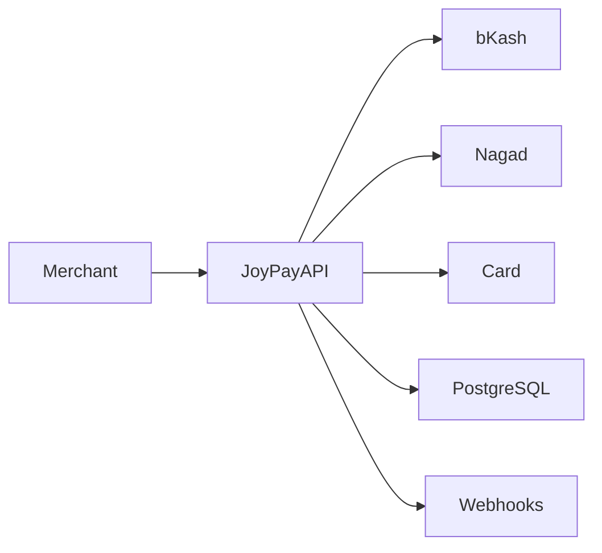

<div align="center">

# 🚀 Joy Pay

### Modern Payment Gateway Infrastructure for Bangladesh

Secure, scalable, and developer-friendly payment processing built with NestJS, Prisma, PostgreSQL, and TypeScript.

<p align="center">
  <a href="./API_DOCUMENTATION.md">
    
  </a>
  <a href="http://localhost:3000/docs">
    
  </a>
</p>

<p align="center">
  
  
  
  
  
</p>

</div>

---

## ✨ Features

- 🔐 HMAC SHA256 Authentication
- 🔑 JWT Authentication
- 💳 Payment Processing
- 🏪 Merchant Management
- 📊 Transaction Tracking
- 🔔 Webhook Events
- 📄 Swagger Documentation
- ⚡ NestJS Architecture
- 🗄️ PostgreSQL + Prisma ORM
- 🚀 Production Ready Structure

---

## 🏗 Architecture



---

## 📦 Tech Stack

| Layer | Technology |
|---------|------------|
| Backend | NestJS |
| Language | TypeScript |
| Database | PostgreSQL |
| ORM | Prisma |
| Authentication | JWT + HMAC |
| API Docs | Swagger |

---

## 🚀 Quick Start

### Clone Repository

```bash
git clone https://github.com/adnanhjoy/joy-pay.git

cd joy-pay
```

### Install Dependencies

```bash
npm install
```

### Setup Environment

```env
DATABASE_URL=
JWT_SECRET=
PORT=3000
```

### Generate Prisma Client

```bash
npx prisma generate
```

### Run Migrations

```bash
npx prisma migrate dev
```

### Start Development Server

```bash
npm run start:dev
```

Server will run at:

```bash
http://localhost:3000
```

---

## 💳 Supported Providers

| Provider | Status |
|------------|--------|
| bKash | Supported |
| Nagad | Supported |
| Card | Supported |

---

## 🔄 Payment Lifecycle

```text
INITIATED
    ↓
PENDING
    ↓
SUCCESS
    ↓
WEBHOOK SENT
```

Failed Flow:

```text
INITIATED
    ↓
PENDING
    ↓
FAILED
```

---

## 🔔 Webhooks

Example:

```json
{
  "event": "payment.success",
  "transactionId": "uuid",
  "amount": 100,
  "provider": "bkash",
  "timestamp": "2026-01-01T00:00:00.000Z"
}
```

---

## 🛡 Security

Joy Pay implements:

- HMAC SHA256 Request Signing
- Timestamp Verification
- Replay Attack Protection
- JWT Access Tokens
- Input Validation
- Global Exception Handling

---

## 📂 Project Structure

```text
src
│
├── auth
├── merchant
├── payments
├── transactions
├── webhook
├── common
├── config
├── prisma
│
├── app.module.ts
└── main.ts
```

---

## 📚 Documentation

### Swagger UI

```text
http://localhost:3000/docs
```

### OpenAPI Specification

Generated automatically via Swagger.

---

## 🗺 Roadmap

- [x] Merchant Management
- [x] JWT Authentication
- [x] HMAC Authentication
- [x] Payment Processing
- [x] Transaction Tracking
- [x] Webhooks
- [ ] Refund System
- [ ] Settlement Engine
- [ ] Multi Currency
- [ ] Real bKash Integration
- [ ] Real Nagad Integration
- [ ] Admin Dashboard

---

<div align="center">

Built with ❤️ using NestJS & TypeScript

</div>